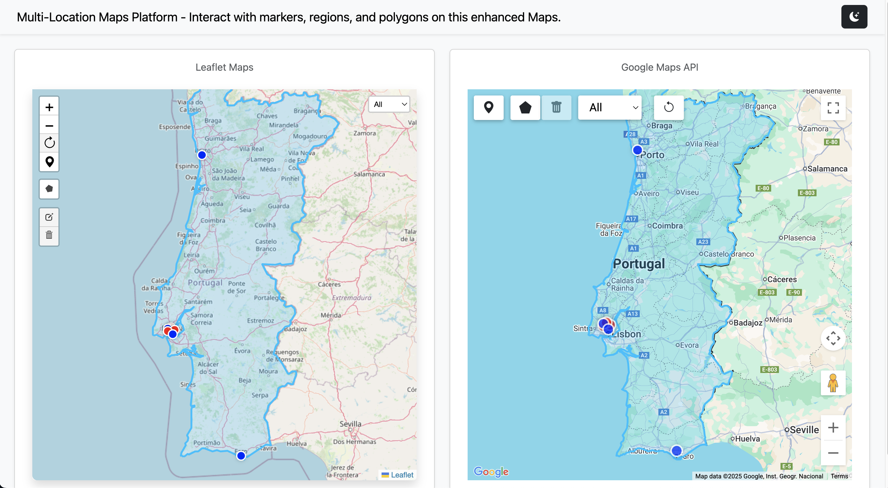

# Multi-Location Map Interaction Platform

This project is a React-based interactive mapping solution designed to help companies visually display all locations where their products or services are available. The platform provides an intuitive map interface where users can explore store locations, service coverage areas, or distribution points in real time.
The solution is particularly suited for businesses that operate multiple branches, retail stores, service hubs, or franchise locations, enabling them to offer customers a seamless way to discover the nearest point of service.
Key Features

# 1. Interactive Map Visualization

Integrates with modern mapping providers (Google Maps, Mapbox, Leaflet, or OpenStreetMap).
Displays all store or service locations using custom markers or icons.
Supports zooming, panning, clustering, and dynamic filtering.

# 2. Store & Service Discovery

Users can search for locations by country, state, city, or filters such as service type.
Option to show distance from the user’s current location (geolocation support).
Ideal for companies offering localized services (e.g., delivery, customer support, pickups).

# 3. Rich Location Details

Clicking on a marker opens a detail panel with:
Store address and hours
Contact information
Available services or products
Photos or promotions (optional)

# 4. Administrative Backend (Optional)

A management interface for company admins to:
Add, update, or remove store locations
Configure service availability
Upload data from CSV/Excel or integrate with a company API

# 5. Adaptable for Different Industries

This solution can be customized for:
Retail chains with multiple stores
Service providers (cleaning, repairs, installations)
Food delivery or restaurant franchises
Logistics and pickup/drop-off networks
Healthcare clinics or professionals with regional offices
Benefits for Companies
Enhances customer experience by simplifying location discovery
Centralizes location data into one easy-to-use interface
Improves service transparency and trust
Reduces support inquiries asking “Where can I find your service?”
Increases conversion by connecting users to the nearest active location

# 6. Technology Stack

Frontend: React + preferred map library (Mapbox GL, Leaflet, or Google Maps API)
Optional Backend: Node or Python API with database (MongoDB / PostgreSQL / SQLite)
Integration Options: REST APIs, CRM data import, or POS system sync

# 7. Commands

````

npx create-vite@latest . -- --template react

Select a framework: React
Select a variant: JavaScript
Use rolldown-vite (Experimental)?: No
Install with npm and start now? Yes

npm i -S react@18 react-dom@18
npm i -S react-router-dom

npm i -S leaflet
npm i -S leaflet-draw
npm i -S react-leaflet@next
npm i -S react-leaflet-cluster
npm i -S react-leaflet-draw

npm i -D prettier eslint-config-prettier eslint-plugin-prettier

npm i -D gh-pages

npm i -S aos
npm i -S bootstrap
npm i -S bootstrap-icons
npm i -S reactstrap

npm i -S @vis.gl/react-google-maps

Copy files from other project
.env
eslint.config.js
.prettierrc
.prettierignore

Setup package.json

  "scripts": {
    "dev": "vite",
    "build": "vite build",
    "preview": "vite preview",
    "lint": "eslint . --ext js,jsx",
    "lint:fix": "eslint . --ext js,jsx --fix",
    "format": "prettier --write .",
    "deploy": "gh-pages -d dist"
  },

    "repository": {
    "type": "git",
    "url": "git+https://github.com/devrazec/map.git"
  },

   "homepage": "https://github.com/devrazec/map",

npm run build
npm run deploy

php -S localhost:8080

````

## Links

Credentials compatible with this API
https://console.cloud.google.com/google/maps-apis/credentials?project=react-462614

Collection of React components @vis.gl/react-google-maps 
https://visgl.github.io/react-google-maps/docs/get-started

Example creates circles on the map
https://developers.google.com/maps/documentation/javascript/examples/circle-simple?hl=en

React UI Library
https://reactstrap.github.io/?path=/docs/home-installation--page

## Github

1. Remove it from git tracking (but keep the local file):
git rm --cached .env
2. Commit this change:
git commit -m "Stop tracking .env file"
3. Push to remote:
git push

## Web Interface

http://localhost:3000



## Demo

https://devrazec.github.io/map